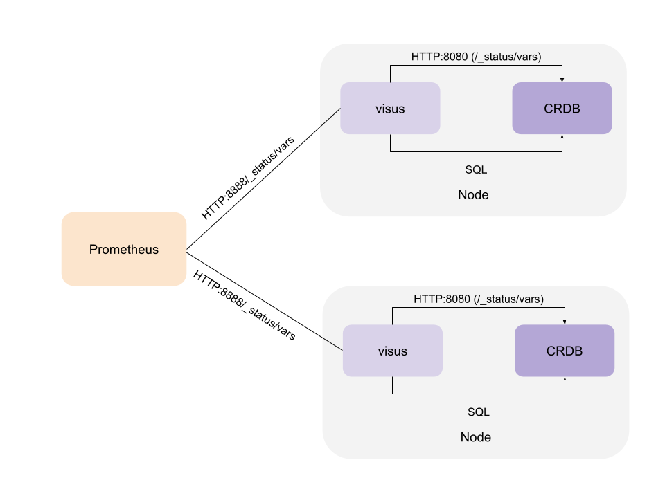

# visus
Visus (latin for "the action of looking") enables users to collect metrics using arbitrary SQL queries and expose them in a Prometheus format. Optionally, it can be configured to filter the metrics CockroachDB available in the `/_status/vars` endpoint.

Visus runs as a sidecar on each node of a CockroachDB cluster, as shown in the diagram below.
It can also be used for any database that is compatible with the Postgres wire protocol.



## Metric configuration

Metrics are grouped in collections and stored in the `_visus` database. Each collection uses a SQL query to collect the metrics, and determines how often the metrics need to be fetched.

The SQL query result columns are mapped into labels and metrics values.
The labels define the dimensions for a metric (for instance the database name or the application name).
When configuring a collection, the administrator will specify the type of the metric (e.g. counter or gauge) and a description of metric.

The template of the query is as follows (common table expressions are allowed; a parameter for limit must be provided):

```sql
SELECT 
   label_1, ... ,label_n, metric_1, ... metric_m
FROM 
   ... 
WHERE 
   ... 
LIMIT 
   $1
```

The Prometheus collectors will add additional labels to track the cluster name as well as the instance where the metrics are coming from.

## Database Security 
It is recommended to use separate users for managing the configuration and to run the sidecar.
The sidecar needs `SELECT ON TABLES` privilege on the `_visus` database to read the configuration. To run many of the sample collections available in the examples directory, 
the 'VIEWACTIVITY' option should be granted to the user.
The `./visus collection init` command will provision a `visus` user with the minimal privileges to run the sidecar. Defining new collection may require additional privileges, depending on what data the SQL query associated to the collection has to access.

## Example

For instance, to track the sql activity at a application and database level, we can use this yaml configuration (saved into the query_count.yaml file)
There are two labels (application, database) that are returned as the first 2 columns in the SQL query.
We have a metric, exec_count, which is a counter; its description is "statement count per application and database".
We would like to have at most 50 results and fetch the metrics every 10 seconds.

```yaml
name: query_count
frequency: 10
maxresults: 50
labels: [application,database]
metrics:
  - name : exec_count
    kind : counter
    help : statement count per application and database.
query:
  SELECT
    application_name as application,
    database_name as database,
    sum(count) AS exec_count
  FROM
        crdb_internal.node_statement_statistics
  WHERE
        application_name NOT LIKE '$ internal-%'
  GROUP BY
        application_name, database_name
  ORDER BY
        exec_count DESC
  LIMIT
        $1;
```

Assuming we have:

 * `$ADMIN_CRDB_URL`: variable that defines the URL to connect to the database, for managing the rules.
 * `$VISUS_CRDB_URL`: variable that defines the URL to connect to the database, for running the sidecar.

```bash
ADMIN_CRDB_URL="postgresql://root@localhost:26257/defaultdb?sslmode=disable"
VISUS_CRDB_URL="postgresql://visus@localhost:26257/defaultdb?sslmode=disable"
```

Initialize the database that contains the configuration for the collections:

```bash
./visus collection init --url "$ADMIN_CRDB_URL" 
```

For this example, we use the `visus` user, with the following privileges:

```sql
CREATE USER IF NOT EXISTS visus;
ALTER ROLE visus WITH VIEWACTIVITY;
GRANT CONNECT ON DATABASE _visus to visus;
```

Now, we can create a new collection in the database using the `visus put` command. 

```bash
./visus collection put --url "$ADMIN_CRDB_URL" --yaml query_count.yaml 
```

Result:

```text
Collection query_count inserted.
```

List all the collection names in the database:

```bash
./visus collection list --url "$ADMIN_CRDB_URL"
```

Result:

```text
query_count
```

View the query_count collection definition:

```bash
./visus collection get query_count --url "$ADMIN_CRDB_URL"
```

Result:

```text
name: query_count
frequency: 10
maxresults: 100
enabled: true
query: SELECT application_name as application, database_name as database, sum(count) AS exec_count FROM crdb_internal.node_statement_statistics WHERE application_name NOT LIKE '$ internal-%' GROUP BY application_name, database_name ORDER BY exec_count DESC LIMIT $1;
labels:
    - application
    - database
metrics:
    - name: exec_count
      kind: counter
      help: statement count per application and database.
```

Test the collection, and fetch the metrics twice, with default interval (10 seconds):

```bash
./visus collection test query_count --url "$VISUS_CRDB_URL" --count 2
```

Sample results:

```text
---- 11-12-2022 17:03:09 query_count -----
# HELP query_count_exec_count statement count per application and database.
# TYPE query_count_exec_count counter
query_count_exec_count{application="",database="_visus"} 7
query_count_exec_count{application="",database="defaultdb"} 16

---- 11-12-2022 17:03:19 query_count -----
# HELP query_count_exec_count statement count per application and database.
# TYPE query_count_exec_count counter
query_count_exec_count{application="",database="_visus"} 7
query_count_exec_count{application="",database="defaultdb"} 17
```

Start the server to enable collection of metrics from Prometheus.

```bash
./visus start --insecure --endpoint "/_status/custom"  --url "$VISUS_CRDB_URL" 
```

## Histogram rewriting

Visus can also act as a proxy to filter and rewrite CockroachDB histograms (v22.1 and earlier) from a log-2 linear format (HDR histograms) to a log-10 linear format. 
Users can specify which histograms to rewrite based on a regular expression. For instance to rewrite all the histograms that match "^sql_exec_latency$" and keep buckets between 1ms and 20sec, we specify in the configuration file `latency.yaml`:
```yaml
name: latency
regex: ^sql_exec_latency$
enabled: true
start: 1000000
end: 20000000000
```

```bash
./visus histogram put --yaml latency.yaml  --url "$ADMIN_CRDB_URL" 
```

Result:

```text
histogram latency inserted.
```

To enable filter in the server,

Start the server to enable collection of metrics from Prometheus, specify the collection endpoint with the `--promethues` flag.

```bash
./visus start --insecure --endpoint "/_status/custom"  --url "$VISUS_CRDB_URL" --prometheus "http://localhost:8080/_status/vars"
```

## Commands

### Collection management commands

Use the `visus collection` command to manage the collections in the database.

```text
Usage:
  visus collection [command]

Available Commands:
  delete
  get
  init
  list
  put
  test

Flags:
  -h, --help         help for collection
      --url string   Connection URL, of the form: postgresql://[user[:passwd]@]host[:port]/[db][?parameters...]

Global Flags:
      --logDestination string   write logs to a file, instead of stdout
      --logFormat string        choose log output format [ fluent, text ] (default "text")
  -v, --verbose count           increase logging verbosity to debug; repeat for trace

Use "visus collection [command] --help" for more information about a command.
  ```

### Histogram filter management commands

Use the `visus histogram` command to manage the collections in the database.

```text
Usage:
  visus histogram [command]

Available Commands:
  delete
  get
  list
  put
  test

Flags:
  -h, --help         help for histogram
      --url string   Connection URL, of the form: postgresql://[user[:passwd]@]host[:port]/[db][?parameters...]

Global Flags:
      --logDestination string   write logs to a file, instead of stdout
      --logFormat string        choose log output format [ fluent, text ] (default "text")
  -v, --verbose count           increase logging verbosity to debug; repeat for trace

Use "visus histogram [command] --help" for more information about a command.
```

### Starting a server

To start the server, use the `visus start` command:

```text
Usage:
  visus start [flags]

Examples:

./visus start --bindAddr "127.0.0.1:15432" 

Flags:
      --bind-addr string     A network address and port to bind to (default "127.0.0.1:8888")
      --bind-cert string     Path to the  TLS certificate for the server
      --bind-key string      Path to the  TLS key for the server
      --ca-cert string       Path to the  CA certificate
      --endpoint string      Endpoint for metrics. (default "/_status/vars")
  -h, --help                 help for start
      --insecure             this flag must be set if no TLS configuration is provided
      --proc-metrics         enable the collection of process metrics
      --prometheus string    prometheus endpoint
      --refresh duration     How ofter to refresh the configuration from the database. (default 5m0s)
      --rewrite-histograms   enable histogram rewriting
      --url string           Connection URL, of the form: postgresql://[user[:passwd]@]host[:port]/[db][?parameters...]
      --visus-metrics        enable the collection of visus metrics

Global Flags:
      --logDestination string   write logs to a file, instead of stdout
      --logFormat string        choose log output format [ fluent, text ] (default "text")
  -v, --verbose count           increase logging verbosity to debug; repeat for trace
```
